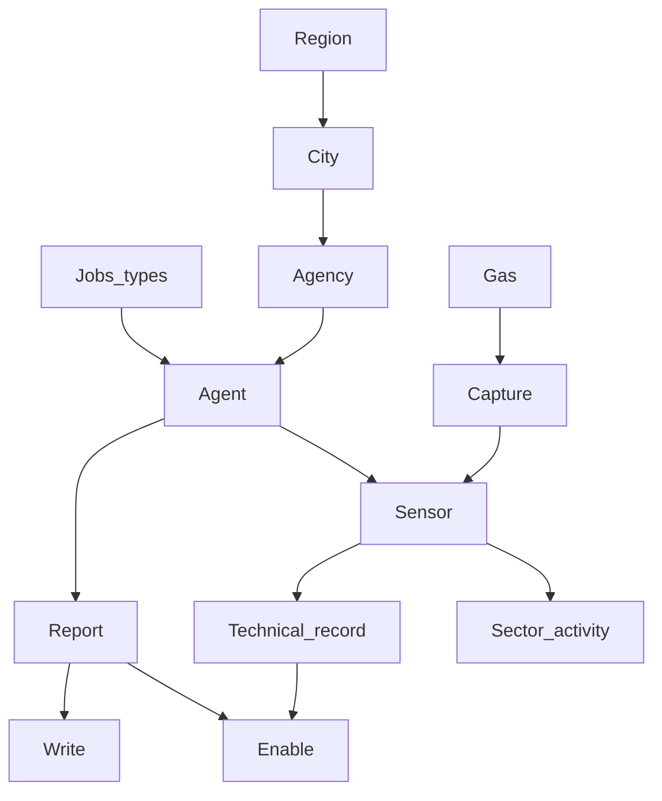

PROJET DATAX 

Dans le cadre du dernier rapport du GIEC, le ministère de l’écologie contacte votre entreprise DATA-X. Il vous mandate pour réaliser un outil pour stocker et interroger des données publiques sur la qualité de l’air dans les grandes villes de France. Ces données seront stockées dans une base de données relationnelle.

Requêtes SQL

Peuplement (origine des données, difficultés rencontrées, fonctionnalités présentes ou absentes...)

# BDD

MLD


- Script création bdd
    
    ```sql
    #------------------------------------------------------------
    #        Script MySQL.
    #------------------------------------------------------------
    
    #------------------------------------------------------------
    # Table: Gas
    #------------------------------------------------------------
    
    CREATE TABLE Gas(
            Gas_ID   Int  Auto_increment  NOT NULL ,
            Gas      Varchar (55) NOT NULL ,
            Gas_type Varchar (30) NOT NULL
    	,CONSTRAINT Gas_PK PRIMARY KEY (Gas_ID)
    )ENGINE=InnoDB;
    
    #------------------------------------------------------------
    # Table: Report 
    #------------------------------------------------------------
    
    CREATE TABLE Report(
            Report_ID   Int  Auto_increment  NOT NULL ,
            Report_date Date NOT NULL
    	,CONSTRAINT Report_PK PRIMARY KEY (Report_ID)
    )ENGINE=InnoDB;
    
    #------------------------------------------------------------
    # Table: Sector Activity
    #------------------------------------------------------------
    
    CREATE TABLE Sector_Activity(
            Sector_ID       Int  Auto_increment  NOT NULL ,
            Sector_activity Varchar (200) NOT NULL
    	,CONSTRAINT Sector_Activity_PK PRIMARY KEY (Sector_ID)
    )ENGINE=InnoDB;
    
    #------------------------------------------------------------
    # Table: Jobs_types
    #------------------------------------------------------------
    
    CREATE TABLE Jobs_types(
            Jobs_type Varchar (30) NOT NULL ,
            Tasks     Varchar (200) NOT NULL
    	,CONSTRAINT Jobs_types_PK PRIMARY KEY (Jobs_type)
    )ENGINE=InnoDB;
    
    #------------------------------------------------------------
    # Table: Region
    #------------------------------------------------------------
    
    CREATE TABLE Region(
            Region_ID   Int  Auto_increment  NOT NULL ,
            Region_name Varchar (50)
    	,CONSTRAINT Region_PK PRIMARY KEY (Region_ID)
    )ENGINE=InnoDB;
    
    #------------------------------------------------------------
    # Table: City
    #------------------------------------------------------------
    
    CREATE TABLE City(
            City_ID     Int  Auto_increment  NOT NULL ,
            City_name   Varchar (40) NOT NULL ,
            Postal_code Varchar (10) NOT NULL ,
            Region_ID   Int NOT NULL
    	,CONSTRAINT City_PK PRIMARY KEY (City_ID)
    
    	,CONSTRAINT City_Region_FK FOREIGN KEY (Region_ID) REFERENCES Region(Region_ID)
    )ENGINE=InnoDB;
    
    #------------------------------------------------------------
    # Table: Agency
    #------------------------------------------------------------
    
    CREATE TABLE Agency(
            Agency_ID Int  Auto_increment  NOT NULL ,
            City_ID   Int NOT NULL
    	,CONSTRAINT Agency_PK PRIMARY KEY (Agency_ID)
    
    	,CONSTRAINT Agency_City_FK FOREIGN KEY (City_ID) REFERENCES City(City_ID)
    )ENGINE=InnoDB;
    
    #------------------------------------------------------------
    # Table: Agent
    #------------------------------------------------------------
    
    CREATE TABLE Agent(
            Employee_ID   Int  Auto_increment  NOT NULL ,
            Name          Varchar (100) NOT NULL ,
            First_name    Varchar (100) NOT NULL ,
            Birth_date    Date NOT NULL ,
            Start_date    Date NOT NULL ,
            Street_number Int NOT NULL ,
            Adress        Varchar (100) NOT NULL ,
            Active        Bool NOT NULL ,
            City_ID       Int NOT NULL ,
            Agency_ID     Int ,
            Jobs_type     Varchar (30) NOT NULL
    	,CONSTRAINT Agent_PK PRIMARY KEY (Employee_ID)
    
    	,CONSTRAINT Agent_City_FK FOREIGN KEY (City_ID) REFERENCES City(City_ID)
    	,CONSTRAINT Agent_Agency0_FK FOREIGN KEY (Agency_ID) REFERENCES Agency(Agency_ID)
    	,CONSTRAINT Agent_Jobs_types1_FK FOREIGN KEY (Jobs_type) REFERENCES Jobs_types(Jobs_type)
    )ENGINE=InnoDB;
    
    #------------------------------------------------------------
    # Table: Sensor
    #------------------------------------------------------------
    
    CREATE TABLE Sensor(
            Sensor_ID    Int  Auto_increment  NOT NULL ,
            Employee_ID  Int NOT NULL ,
            Sector_ID    Int NOT NULL ,
            City_ID      Int NOT NULL
    	,CONSTRAINT Sensor_PK PRIMARY KEY (Sensor_ID)
    
    	,CONSTRAINT Sensor_Agent_FK FOREIGN KEY (Employee_ID) REFERENCES Agent(Employee_ID)
    	,CONSTRAINT Sensor_Sector_Activity0_FK FOREIGN KEY (Sector_ID) REFERENCES Sector_Activity(Sector_ID)
    	,CONSTRAINT Sensor_City1_FK FOREIGN KEY (City_ID) REFERENCES City(City_ID)
    )ENGINE=InnoDB;
    
    #------------------------------------------------------------
    # Table: Technical_Record
    #------------------------------------------------------------
    
    CREATE TABLE Technical_Record(
            Record_ID     Int  Auto_increment  NOT NULL ,
            Recorded_data Float NOT NULL ,
            Recorded_date Date NOT NULL ,
            Sensor_ID     Int NOT NULL ,
            Employee_ID   Int NOT NULL ,
            Gas_ID        Int NOT NULL
    	,CONSTRAINT Technical_Record_PK PRIMARY KEY (Record_ID)
    
    	,CONSTRAINT Technical_Record_Sensor_FK FOREIGN KEY (Sensor_ID) REFERENCES Sensor(Sensor_ID)
    	,CONSTRAINT Technical_Record_Agent0_FK FOREIGN KEY (Employee_ID) REFERENCES Agent(Employee_ID)
    	,CONSTRAINT Technical_Record_Gas1_FK FOREIGN KEY (Gas_ID) REFERENCES Gas(Gas_ID)
    )ENGINE=InnoDB;
    
    #------------------------------------------------------------
    # Table: Capture
    #------------------------------------------------------------
    
    CREATE TABLE Capture(
            Gas_ID    Int NOT NULL ,
            Sensor_ID Int NOT NULL
    	,CONSTRAINT Capture_PK PRIMARY KEY (Gas_ID,Sensor_ID)
    
    	,CONSTRAINT Capture_Gas_FK FOREIGN KEY (Gas_ID) REFERENCES Gas(Gas_ID)
    	,CONSTRAINT Capture_Sensor0_FK FOREIGN KEY (Sensor_ID) REFERENCES Sensor(Sensor_ID)
    )ENGINE=InnoDB;
    
    #------------------------------------------------------------
    # Table: Write_
    #------------------------------------------------------------
    
    CREATE TABLE Write_(
            Employee_ID  Int NOT NULL ,
            Report_ID    Int NOT NULL
    	,CONSTRAINT Write__PK PRIMARY KEY (Employee_ID,Report_ID)
    
    	,CONSTRAINT Write__Agent_FK FOREIGN KEY (Employee_ID) REFERENCES Agent(Employee_ID)
    	,CONSTRAINT Write__Report0_FK FOREIGN KEY (Report_ID) REFERENCES Report(Report_ID)
    )ENGINE=InnoDB;
    
    #------------------------------------------------------------
    # Table: Enable_
    #------------------------------------------------------------
    
    CREATE TABLE Enable_(
            Report_ID Int NOT NULL ,
            Record_ID Int NOT NULL
    	,CONSTRAINT Enable__PK PRIMARY KEY (Report_ID,Record_ID)
    
    	,CONSTRAINT Enable__Report_FK FOREIGN KEY (Report_ID) REFERENCES Report(Report_ID)
    	,CONSTRAINT Enable__Technical_Record0_FK FOREIGN KEY (Record_ID) REFERENCES Technical_Record(Record_ID)
    )ENGINE=InnoDB;
    ```
    
- Script del all bdd
    
    ```sql
    DROP TABLE Write_;
    DROP TABLE Enable_;
    DROP TABLE Report;
    DROP TABLE Capture;
    DROP TABLE Technical_record;
    DROP TABLE Gas;
    DROP TABLE Sensor;
    DROP TABLE Sector_activity;
    DROP TABLE Agent;
    DROP TABLE Jobs_types;
    DROP TABLE Agency;
    DROP TABLE City;
    DROP TABLE Region;
    ```
    

# Peuplement de la BDD


2000 Relevés
250 Employés
200 Capteur
100 Villes
50 Rapports
25 Agences

- ✅ Region :
    
    ```sql
    DELETE FROM livrable.Region;
    ALTER TABLE livrable.Region AUTO_INCREMENT = 1;
    
    INSERT INTO livrable.Region (Region_name) VALUES 
    ('Auvergne-Rhône-Alpes'),
    ('Bourgogne-Franche-Comté'),
    ('Bretagne'),
    ('Centre-Val de Loire'),
    ('Corse'),
    ('Grand Est'),
    ('Hauts-de-France'),
    ('Île-de-France'),
    ('Normandie'),
    ('Nouvelle-Aquitaine'),
    ('Occitanie'),
    ('Pays de la Loire'),
    ('Provence-Alpes-Côte d\'Azur'),
    ('La Réunion'),
    ('Martinique'),
    ('Mayotte'),
    ('Guyane');
    ```
    
- ✅ City :
    
    Temporary Tab
    
    ```sql
    DROP TEMPORARY TABLE IF EXISTS Temp_City_Region;
    
    CREATE TEMPORARY TABLE Temp_City_Region (
      City VARCHAR(40),
      Postal_code VARCHAR(10),
      Region_name VARCHAR(50)
    );
    
    INSERT INTO Temp_City_Region (City, Postal_code, Region_name) 
    VALUES
    	('Paris', '75000', 'Île-de-France'),
    	('Marseille', '13000', 'Provence-Alpes-Côte d\'Azur'),
    	('Lyon', '69000', 'Auvergne-Rhône-Alpes'),
    	('Toulouse', '31000', 'Occitanie'),
    	('Nice', '06000', 'Provence-Alpes-Côte d\'Azur'),
    	('Nantes', '44000', 'Pays de la Loire'),
    	('Montpellier', '34000', 'Occitanie'),
    	('Strasbourg', '67000', 'Grand Est'),
    	('Bordeaux', '33000', 'Nouvelle-Aquitaine'),
    	('Lille', '59000', 'Hauts-de-France'),
    	('Rennes', '35000', 'Bretagne'),
    	('Reims', '51100', 'Grand Est'),
    	('Saint-Étienne', '42000', 'Auvergne-Rhône-Alpes'),
    	('Le Havre', '76600', 'Normandie'),
    	('Toulon', '83000', 'Provence-Alpes-Côte d\'Azur'),
    	('Grenoble', '38000', 'Auvergne-Rhône-Alpes'),
    	('Dijon', '21000', 'Bourgogne-Franche-Comté'),
    	('Angers', '49000', 'Pays de la Loire'),
    	('Nîmes', '30000', 'Occitanie'),
    	('Villeurbanne', '69100', 'Auvergne-Rhône-Alpes'),
    	('Saint-Denis', '93200', 'Île-de-France'),
    	('Aix-en-Provence', '13100', 'Provence-Alpes-Côte d\'Azur'),
    	('Le Mans', '72000', 'Pays de la Loire'),
    	('Clermont-Ferrand', '63000', 'Auvergne-Rhône-Alpes'),
    	('Brest', '29200', 'Bretagne'),
    	('Tours', '37000', 'Centre-Val de Loire'),
    	('Amiens', '80000', 'Hauts-de-France'),
    	('Limoges', '87000', 'Nouvelle-Aquitaine'),
    	('Annecy', '74000', 'Auvergne-Rhône-Alpes'),
    	('Perpignan', '66000', 'Occitanie'),
    	('Boulogne-Billancourt', '92100', 'Île-de-France'),
    	('Metz', '57000', 'Grand Est'),
    	('Besançon', '25000', 'Bourgogne-Franche-Comté'),
    	('Orléans', '45000', 'Centre-Val de Loire'),
    	('Argenteuil', '95100', 'Île-de-France'),
    	('Rouen', '76000', 'Normandie'),
    	('Mulhouse', '68100', 'Grand Est'),
    	('Montreuil', '93100', 'Île-de-France'),
    	('Saint-Paul', '97460', 'La Réunion'),
    	('Caen', '14000', 'Normandie'),
    	('Nancy', '54000', 'Grand Est'),
    	('Tourcoing', '59200', 'Hauts-de-France'),
    	('Roubaix', '59100', 'Hauts-de-France'),
    	('Nanterre', '92000', 'Île-de-France'),
    	('Vitry-sur-Seine', '94400', 'Île-de-France'),
    	('Avignon', '84000', 'Provence-Alpes-Côte d\'Azur'),
    	('Créteil', '94000', 'Île-de-France'),
    	('Dunkerque', '59140', 'Hauts-de-France'),
    	('Poitiers', '86000', 'Nouvelle-Aquitaine'),
    	('Aubervilliers', '93300', 'Île-de-France'),
    	('Asnières-sur-Seine', '92600', 'Île-de-France'),
    	('Colombes', '92700', 'Île-de-France'),
    	('Versailles', '78000', 'Île-de-France'),
    	('Aulnay-sous-Bois', '93600', 'Île-de-France'),
    	('Saint-Pierre', '97410', 'La Réunion'),
    	('Courbevoie', '92400', 'Île-de-France'),
    	('Fort-de-France', '97200', 'Martinique'),
    	('Cherbourg-en-Cotentin', '50100', 'Normandie'),
    	('Rueil-Malmaison', '92500', 'Île-de-France'),
    	('Champigny-sur-Marne', '94500', 'Île-de-France'),
    	('Le Tampon', '97430', 'La Réunion'),
    	('Pau', '64000', 'Nouvelle-Aquitaine'),
    	('Béziers', '34500', 'Occitanie'),
    	('La Rochelle', '17000', 'Nouvelle-Aquitaine'),
    	('Calais', '62100', 'Hauts-de-France'),
    	('Saint-Maur-des-Fossés', '94100', 'Île-de-France'),
    	('Cannes', '06400', 'Provence-Alpes-Côte d\'Azur'),
    	('Antibes', '06600', 'Provence-Alpes-Côte d\'Azur'),
    	('Mamoudzou', '97600', 'Mayotte'),
    	('Mérignac', '33700', 'Nouvelle-Aquitaine'),
    	('Drancy', '93700', 'Île-de-France'),
    	('Colmar', '68000', 'Grand Est'),
    	('Saint-Nazaire', '44600', 'Pays de la Loire'),
    	('Ajaccio', '20000', 'Corse'),
    	('Issy-les-Moulineaux', '92130', 'Île-de-France'),
    	('Évry-Courcouronnes', '91000', 'Île-de-France'),
    	('Noisy-le-Grand', '93160', 'Île-de-France'),
    	('Bourges', '18000', 'Centre-Val de Loire'),
    	('Vénissieux', '69200', 'Auvergne-Rhône-Alpes'),
    	('La Seyne-sur-Mer', '83500', 'Provence-Alpes-Côte d\'Azur'),
    	('Cergy', '95000', 'Île-de-France'),
    	('Levallois-Perret', '92300', 'Île-de-France'),
    	('Quimper', '29000', 'Bretagne'),
    	('Valence', '26000', 'Auvergne-Rhône-Alpes'),
    	('Villeneuve-d\'Ascq', '59650', 'Hauts-de-France'),
    	('Antony', '92160', 'Île-de-France'),
    	('Pessac', '33600', 'Nouvelle-Aquitaine'),
    	('Ivry-sur-Seine', '94200', 'Île-de-France'),
    	('Troyes', '10000', 'Grand Est'),
    	('Cayenne', '97300', 'Guyane'),
    	('Neuilly-sur-Seine', '92200', 'Île-de-France'),
    	('Montauban', '82000', 'Occitanie'),
    	('Clichy', '92110', 'Île-de-France'),
    	('Chambéry', '73000', 'Auvergne-Rhône-Alpes'),
    	('Niort', '79000', 'Nouvelle-Aquitaine'),
    	('Sarcelles', '95200', 'Île-de-France'),
    	('Lorient', '56100', 'Bretagne'),
    	('Beauvais', '60000', 'Hauts-de-France'),
    	('Le Blanc-Mesnil', '93150', 'Île-de-France')
    ```
    
    ```sql
    DELETE FROM City;
    ALTER TABLE City AUTO_INCREMENT = 1;
    
    INSERT INTO City (City_name, Postal_code, Region_ID)
    SELECT TCR.City, TCR.Postal_code, R.Region_ID
    FROM Temp_City_Region AS TCR
    JOIN Region AS R ON TCR.Region_name = R.Region_name;
    
    DROP TEMPORARY TABLE IF EXISTS Temp_City_Region;
    ```
    
- ✅ Agency :
    
    Temporary tab
    
    ```sql
    DROP TEMPORARY TABLE IF EXISTS Temp_Agency_City;
    
    CREATE TEMPORARY TABLE Temp_Agency_City (
      City_name VARCHAR(50)
    );
    
    INSERT INTO Temp_Agency_City (City_name) 
    VALUES
    	('Paris'),
    	('Marseille'),
    	('Lyon'),
    	('Toulouse'),
    	('Nice'),
    	('Nantes'),
    	('Montpellier'),
    	('Strasbourg'),
    	('Bordeaux'),
    	('Lille'),
    	('Rennes'),
    	('Reims'),
    	('Saint-Étienne'),
    	('Le Havre'),
    	('Toulon'),
    	('Grenoble'),
    	('Dijon'),
    	('Angers'),
    	('Nîmes'),
    	('Villeurbanne'),
    	('Saint-Denis'),
    	('Aix-en-Provence'),
    	('Le Mans'),
    	('Clermont-Ferrand'),
    	('Brest')
    ```
    
    ```sql
    DELETE FROM Agency;
    ALTER TABLE Agency AUTO_INCREMENT = 1;
    
    INSERT INTO Agency (City_ID)
    SELECT City.City_ID 
    FROM Temp_Agency_City AS TAC
    JOIN City ON City.City_name = TAC.City_name;
    
    DROP TEMPORARY TABLE IF EXISTS Temp_Agency_City;
    ```
    
- ✅ Gas :
    
    ```sql
    INSERT INTO livrable.Gas (Gas, Gas_type) VALUES 
    ('SO2', 'Accidification'),
    ('NOx', 'Accidification'),
    ('NH3', 'Accidification'),
    ('CO', 'Accidification'),
    ('COVNM', 'Accidification'),
    ('CH4', 'Effet de serre'),
    ('N2O', 'Effet de serre'),
    ('PFC', 'Effet de serre'),
    ('HFC', 'Effet de serre'),
    ('SF6', 'Effet de serre');
    ```
    
- ✅ Jobs_type:
    
    ```sql
    INSERT INTO livrable.Jobs_types (Jobs_type, Tasks) VALUES 
    ('Head of agency', 'Responsible for overseeing all his agency '),
    ('Technical agent', 'Responsible for the proper functioning and maintenance of data sensors'),
    ('Administrative agent', 'Performs data analysis and writes air quality reports');
    ```
    
- ✅ Sector_Activity :
    
    ```sql
    INSERT INTO livrable.sector_activity (Sector_activity) VALUES 
    ('Combustion in the energy and energy conversion industries'),
    ('Combustion outside industry'),
    ('Combustion in manufacturing industry'),
    ('Production processes'),
    ('Extraction and distribution of fossil fuels/geothermal energy'),
    ('Use of solvents and other products'),
    ('Road transport'),
    ('Other mobile sources and machinery'),
    ('Waste treatment and disposal'),
    ('Agriculture and forestry'),
    ('Other biotic sources');
    ```
    
- ✅ Agent :
    
    ```python
    import random
    import datetime
    import mysql.connector
    
    # Nombre
    nb_agent = 250
    nb_city = 98
    nb_agency = 25
    
    # Années minimum et maximum pour la date de naissance
    min_birth_year = 1975
    max_birth_year = 2002
    
    # Années minimum et maximum pour la date d'embauche
    min_hire_year = 2000
    max_hire_year = 2022
    
    # Rate actif
    rate_actif = 0.95
    
    # Roles
    jobs_types = ['Head of agency', 'Technical agent', 'Administrative agent']
    
    # Adresses et numéro de rue
    numeros_rue = [str(i) for i in range(1, 201)]
    adresses = ['rue de la Paix', 'avenue des Champs-Élysées', 'boulevard Haussmann', 'place Vendôme',
                'rue du Faubourg Saint-Honoré',
                'rue Saint-Antoine', 'rue de Rivoli', 'rue de Vaugirard', 'rue de Sèvres', 'rue Montmartre',
                'rue de la Roquette', 'rue de Belleville', 'rue des Martyrs', 'rue de Charonne', 'rue de la Pompe',
                'avenue Montaigne', 'avenue George V', 'avenue Marceau', 'avenue Foch', 'avenue Victor Hugo',
                'rue de la Convention', 'rue de la République', 'rue de Dunkerque', 'rue des Petits Champs',
                'rue de Turenne',
                'rue de la Trémoille', 'rue de la Grange-aux-Belles', 'rue d\'Enghien', 'rue du Cherche-Midi',
                'rue de Montreuil',
                'avenue de la Grande Armée', 'avenue Hoche', 'avenue de la Porte de Champerret', 'rue de Passy',
                'rue de la Tour-Maubourg',
                'rue de la Bienfaisance', 'rue de Solférino', 'rue de Rennes', 'rue des Archives',
                'rue des Francs-Bourgeois',
                'rue Saint-Honoré', 'rue de l\'École de Médecine', 'rue de l\'Odéon', 'rue des Écoles', 'rue de Seine',
                'rue de Grenelle', 'rue de Babylone', 'rue Saint-Dominique', 'rue du Bac', 'rue de Verneuil',
                'rue des Rosiers', 'rue Vieille-du-Temple', 'rue des Archives', 'rue des Francs-Bourgeois',
                'rue Charlot',
                'rue de Bretagne', 'rue de la Roquette', 'rue Oberkampf', 'rue Saint-Maur', 'rue de Belleville',
                'rue de Ménilmontant', 'rue de Bagnolet', 'rue de la Chapelle', 'rue de Clignancourt',
                'rue Marx Dormoy',
                'boulevard de la Chapelle', 'boulevard Barbès', 'boulevard de Clichy', 'boulevard Haussmann',
                'boulevard des Batignolles',
                'boulevard Malesherbes', 'boulevard Pereire', 'boulevard Berthier', 'boulevard Victor',
                'boulevard Saint-Germain']
    
    def add_names(nb_agent, file = 'name.txt'):
        nom = []
        prénom = []
    
        with open(file, 'r', encoding='utf8') as f:
            abc = f.readlines()
            for i in abc:
                ab = i.split(', ')
                nom.append(ab[0])
                if ab[1][-1] == '\n':
                    ab[1] = ab[1][:-1]
                prénom.append(ab[1])
    
        nomprenom = []
    
        for i in nom:
            for j in prénom:
                nomprenom.append([i, j])
    
        nom = []
        prénom = []
    
        for i in range(nb_agent):
            tosplit = random.choice(nomprenom)
            nom.append(tosplit[0])
            prénom.append(tosplit[1])
    
        return nom, prénom
    
    def add_dates(nb_agent, min_birth_year, max_birth_year, min_hire_year, max_hire_year):
        birthday = []
        hire_date = []
    
        for i in range(nb_agent):
            # Génération d'une date d'anniversaire aléatoire
            year = random.randint(min_birth_year, max_birth_year)
            month = random.randint(1, 12)
            day = random.randint(1, 28)
            birthday.append(f'{datetime.date(year, month, day)}')
    
            # Génération d'une date d'embauche aléatoire (aujourd'hui ou plus tard)
            today = datetime.date.today()
            start_date = datetime.date(year + 18, month, day)
            min_hire_date = datetime.date(min_hire_year, 1, 1)
            max_hire_date = datetime.date(max_hire_year, 12, 31)
            hire_date.append(f'{random.choice([today, start_date, min_hire_date, max_hire_date])}')
    
        return birthday, hire_date
    
    def add_address(nb_agent, numeros_rue, adresses):
        street_number = []
        street_name = []
    
        for i in range(nb_agent):
            street_number.append(random.choice(numeros_rue))
            street_name.append(random.choice(adresses))
    
        return street_number, street_name
    
    def add_roles(nb_agent, jobs_types):
        roles = []
        agency_directors = {}
    
        for i in range(nb_agent):
            current_agency_id = agency_ID[i]
    
            if current_agency_id not in agency_directors and active[i]:
                role = jobs_types[0]
                agency_directors[current_agency_id] = i
            else:
                role = random.choice(jobs_types[1:])
    
            roles.append(role)
        return roles
    
    def insert_all(data):
        print('\n##### Connecting to database')
        connexion = mysql.connector.connect(
            user='root',
            password='bananabread',
            host='127.0.0.1',
            database='livrable'
        )
    
        cursor = connexion.cursor()
    
        cursor.execute("DELETE FROM livrable.Agent")
        cursor.execute("ALTER TABLE livrable.Agent AUTO_INCREMENT = 1;")
        connexion.commit()
        print("##### Agent table cleared")
    
        print('##### Adding data to database')
        query = "INSERT INTO Agent (Name, First_name, Birth_date, Start_date, Street_number, Adress, Active, City_ID, Agency_ID, Jobs_type) VALUES (%s, %s, %s, %s, %s, %s, %s, %s, %s, %s)"
        for i in data:
            cursor.execute(query, i)
    
        connexion.commit()
        cursor.close()
        connexion.close()
        print("##### Data inserted successfully into Agent table")
    
    nom, prénom = add_names(nb_agent) # 1. Créer une liste de x noms et prénoms aléatoires
    birthday, hire_date = add_dates(nb_agent, min_birth_year, max_birth_year, min_hire_year, max_hire_year) # 2. Créer une liste de dates de naissance et d'embauche aléatoires
    street_number, street_name = add_address(nb_agent, numeros_rue, adresses) # 3. Créer une liste aléatoire de n° de rue et une liste de rue
    active = [random.random() < rate_actif for i in range(nb_agent)] # 4. Créer une liste aléatoire d'actif ou inactif
    city_ID = [random.randint(1, nb_city) for i in range(nb_agent)] # 5. Créer une liste aléatoire City ID et Agency ID
    agency_ID = [random.randint(1, nb_agency) for i in range(nb_agent)] # 5. Créer une liste aléatoire City ID et Agency ID
    roles = add_roles(nb_agent, jobs_types) # # 6. Créer une liste de rôle (un seul directeur par agence)
    
    data_to_insert = []
    for i in range(nb_agent):
        data_to_insert.append((nom[i], prénom[i], birthday[i], hire_date[i], street_number[i], street_name[i], active[i], city_ID[i], agency_ID[i], roles[i]))
    
    insert_all(data_to_insert)
    ```
    
- ✅ Sensor :
    
    ```python
    import random
    import mysql.connector
    
    nb_agent = 250
    nb_sector = 11
    nb_city = 99
    nb_sensor = 200
    
    # get the list of technical agents from the database
    def get_technical_agents_with_cities():
        agents_id = []
        cities_id = []
    
        print('##### Connecting to database')
        connexion = mysql.connector.connect(
            user='root',
            password='bananabread',
            host='127.0.0.1',
            database='livrable'
        )
    
        cursor = connexion.cursor()
    
        print('##### Getting data from database')
        cursor.execute("SELECT Employee_ID, City_ID FROM livrable.Agent WHERE Jobs_type = 'Technical agent'")
        for i in cursor:
            agents_id.append(i[0])
            cities_id.append(i[1])
        connexion.commit()
        cursor.close()
        connexion.close()
        return agents_id, cities_id
    
    def add_sensor(data):
        print('\n##### Connecting to database')
        connexion = mysql.connector.connect(
            user='root',
            password='bananabread',
            host='127.0.0.1',
            database='livrable'
        )
    
        cursor = connexion.cursor()
    
        cursor.execute("DELETE FROM livrable.Sensor")
        cursor.execute("ALTER TABLE livrable.Sensor AUTO_INCREMENT = 1;")
        connexion.commit()
        print("##### Sensor table cleared")
    
        print('##### Adding data to database')
        query = "INSERT INTO Sensor (Employee_ID, Sector_ID, City_ID) VALUES (%s, %s, %s)"
        for i in data:
            cursor.execute(query, i)
    
        connexion.commit()
        cursor.close()
        connexion.close()
        print("##### Data inserted successfully into Sensor table")
    
    agents, cities = get_technical_agents_with_cities()
    sector = [random.randint(1, nb_sector) for i in range(nb_sensor)]
    
    nb_agent = len(agents)
    sensor = []
    
    for i in range(nb_sensor):
        j = random.randint(0, nb_agent-1) # random agent with cities
        k = random.randint(1, nb_sector) # random sector
    
        sensor.append([agents[j], sector[k], cities[j]])
    
    add_sensor(sensor)
    ```
    
- ✅ Capture :
    
    ```python
    import random
    import mysql.connector
    
    nb_sensor = 200
    nb_gas = 10
    
    def add_capture(data):
        print('\n##### Connecting to database')
        connexion = mysql.connector.connect(
            user='root',
            password='bananabread',
            host='127.0.0.1',
            database='livrable'
        )
    
        cursor = connexion.cursor()
    
        cursor.execute("DELETE FROM livrable.Capture")
        cursor.execute("ALTER TABLE livrable.Capture AUTO_INCREMENT = 1;")
        connexion.commit()
        print("##### Capture table cleared")
    
        print('##### Adding data to database')
        query = "INSERT INTO Capture (Sensor_ID, Gas_ID) VALUES (%s, %s)"
        for i in data:
            cursor.execute(query, i)
    
        connexion.commit()
        cursor.close()
        connexion.close()
        print("##### Data inserted successfully into Capture table")
    
    rate = [(nb_gas-i)/nb_gas for i in range(0, nb_gas)]
    sensor_gas = []
    
    for i in range(1, nb_sensor+1):
        sensor_gas.append([i])
        gas_id = [k for k in range(1, nb_gas)]
        for j in range(0, nb_gas):
            if random.random() < rate[j]:
                sensor_gas[i-1].append(gas_id.pop(random.randint(0, len(gas_id)-1)))
            else :
                break
    
    to_send = []
    for i in sensor_gas:
        for j in i[1:]:
            to_send.append([i[0], j])
    
    add_capture(to_send)
    ```
    
- ✅ Report :
    
    ```sql
    import random
    import mysql.connector
    import datetime
    
    nb_report = 500
    
    date_max = datetime.date.today()
    date_min = datetime.date(2022, 1, 1)
    
    def add_report(data):
        print('\n##### Connecting to database')
        connexion = mysql.connector.connect(
            user='root',
            password='bananabread',
            host='127.0.0.1',
            database='livrable'
        )
    
        cursor = connexion.cursor()
    
        cursor.execute("DELETE FROM livrable.Report")
        cursor.execute("ALTER TABLE livrable.Report AUTO_INCREMENT = 1;")
        connexion.commit()
        print('##### Database cleared')
    
        print('##### Adding data to database')
        query = "INSERT INTO Report (Report_date) VALUES (%s)"
        for i in data:
            cursor.execute(query, [i])
    
        connexion.commit()
        cursor.close()
        connexion.close()
        print('##### Data inserted successfully into Report table')
    
    date = []
    for i in range(nb_report):
        year = random.randint(date_min.year, date_max.year)
        month = random.randint(1, date_max.month)
        day = random.randint(1, 28)
        date.append(f'{datetime.date(year, month, day)}')
    
    add_report(date)
    ```
    
- ✅ Write_
    
    ```python
    import random
    import mysql.connector
    
    nb_rapport = 500
    nb_agent = 250
    
    def get_admistrative():
        agents_id = []
    
        print('##### Connecting to database')
        connexion = mysql.connector.connect(
            user='root',
            password='bananabread',
            host='127.0.0.1',
            database='livrable'
        )
    
        cursor = connexion.cursor()
    
        print('##### Getting data from database')
        cursor.execute("SELECT Employee_ID FROM livrable.Agent WHERE Jobs_type = 'Administrative agent'")
        for i in cursor:
            agents_id.append(i[0])
        connexion.commit()
        cursor.close()
        connexion.close()
    		print("##### Data retrieved successfully from database")
        return agents_id
    
    def add_Write_(data):
        print('\n##### Connecting to database')
        connexion = mysql.connector.connect(
            user='root',
            password='bananabread',
            host='127.0.0.1',
            database='livrable'
        )
    
        cursor = connexion.cursor()
    
        cursor.execute("DELETE FROM livrable.Write_")
        cursor.execute("ALTER TABLE livrable.Write_ AUTO_INCREMENT = 1;")
        connexion.commit()
        print("##### Write_ table cleared")
    
        print('##### Adding data to database')
        query = "INSERT INTO Write_ (Report_ID, Employee_ID) VALUES (%s, %s)"
        for i in data:
            cursor.execute(query, i)
    
        connexion.commit()
        cursor.close()
        connexion.close()
        print("##### Data inserted successfully into Write_ table")
    
    id_agent = get_admistrative()
    nb_agent = len(id_agent)
    
    to_send = []
    for i in range(nb_rapport):
        to_send.append([i+1, id_agent[random.randint(0, nb_agent-1)]])
    
    add_Write_(to_send)
    ```
    
- ✅ Technical_Record :
    
    Récuperer les id capteurs ainsi que le nom et ID des gas qui leurs sont attribués
    
    ```python
    import random
    import datetime
    import mysql.connector
    
    nb_record = 10_000
    date_max = datetime.date(2021, 12, 31)
    date_min = datetime.date(2015, 1, 1)
    rate = 0.05
    
    gas = [
        # Gas name         | Mean value      | Fluctuation
        ['CH4',           1.67777778,       0.21848326], # Methane
        ['CO',            1.0,              0.1], # Carbon monoxide (estimated values)
        ['COVNM',         2.0,              0.2], # Non-Methane Volatile Organic Compounds (estimated values)
        ['HFC',           0.00022800,       0.00003239], # Hydrofluorocarbons
        ['NH3',           0.75411111,       1.27287092], # Ammonia
        ['N2O',           3.27500000,       0.03547024], # Nitrous oxide
        ['NOx',           2.5,              0.25], # Nitrogen oxides (estimated values)
        ['PFC',           0.00008823,       0.00008682], # Perfluorocarbons
        ['SF6',           0.0001,           0.00001], # Sulfur hexafluoride (estimated values)
        ['SO2',           1.5,              0.15]  # Sulfur dioxide (estimated values)
    ]
    
    def find_gas(gas_name):
        for i in gas:
            if i[0] == gas_name:
                return i
    
    # Get list with sensor_id and their attached gas_id and gas_name
    def get_sensor_gas():
        sensor_gas = []
    
        print('##### Connecting to database')
        connexion = mysql.connector.connect(
            user='root',
            password='bananabread',
            host='127.0.0.1',
            database='livrable'
        )
    
        cursor = connexion.cursor()
    
        print('##### Getting data from database')
        cursor.execute("SELECT Sensor.Sensor_ID, Capture.Gas_ID, Gas.Gas, Sensor.Employee_ID FROM Sensor JOIN Capture ON Sensor.Sensor_ID = Capture.Sensor_ID JOIN Gas ON Capture.Gas_ID = Gas.Gas_ID ORDER BY Sensor.Sensor_ID;")
        for i in cursor:
            sensor_gas.append(i)
        connexion.commit()
        cursor.close()
        connexion.close()
        print("##### Data retrieved successfully from database")
        return sensor_gas
    
    def add_record(data):
        print('\n##### Connecting to database')
        connexion = mysql.connector.connect(
            user='root',
            password='bananabread',
            host='127.0.0.1',
            database='livrable'
        )
    
        cursor = connexion.cursor()
    
        cursor.execute("DELETE FROM livrable.Technical_record")
        cursor.execute("ALTER TABLE livrable.Technical_record AUTO_INCREMENT = 1;")
        connexion.commit()
        print('##### Database cleared')
    
        print('##### Adding data to database')
        query = "INSERT INTO Technical_record (Recorded_data, Recorded_date, Sensor_ID, Employee_ID, Gas_ID) VALUES (%s, %s, %s, %s, %s)"
        for i in data:
            cursor.execute(query, i)
    
        connexion.commit()
        cursor.close()
        connexion.close()
        print("##### Data inserted successfully into Technical_record table")
    
    sensor_gas = get_sensor_gas()
    
    date = []
    for i in range(nb_record):
        year = random.randint(date_min.year, date_max.year)
        month = random.randint(1, date_max.month)
        day = random.randint(1, 28)
        date.append(f'{datetime.date(year, month, day)}')
    
    recorded_data = []
    for i in range(nb_record):
        choiced = random.choice(sensor_gas)
    
        # find gas name in gas list
        info_gas = find_gas(choiced[2])
        value = (info_gas[1] + random.uniform(-info_gas[2], info_gas[2]))*(rate*(date_max.year - int(date[i][:4])))
        recorded_data.append([value, date[i], choiced[0], choiced[3], choiced[1]])
    
    add_record(recorded_data)
    ```
    
- ✅ Enable_ :
    
    ```python
    import random
    import mysql.connector
    
    def get_report_and_technical_record():
        report = []
        technical_record = []
    
        print('##### Connecting to database')
        connexion = mysql.connector.connect(
            user='root',
            password='bananabread',
            host='127.0.0.1',
            database='livrable'
        )
    
        cursor = connexion.cursor()
    
        print('##### Getting data from database')
        cursor.execute("SELECT Report_ID FROM livrable.Report ORDER BY Report_ID")
        for i in cursor:
            report.append(i[0])
    
        cursor.execute("SELECT Record_ID, Gas_ID FROM livrable.Technical_record ORDER BY Record_ID")
        for i in cursor:
            technical_record.append([i[0], i[1]])
    
        connexion.commit()
        cursor.close()
        connexion.close()
        print("##### Data retrieved successfully from database")
        return report, technical_record
    
    def find_lot_of_gas(technical_record, gas_id, nb_to_find):
        # list of all gas with the same gas_id
        lot_of_gas = []
        for i in technical_record:
            if i[1] == gas_id:
                lot_of_gas.append(i[0])
        # pick some and remove from the list
        lot_of_gas_choiced = []
        if nb_to_find > len(lot_of_gas):
            nb_to_find = len(lot_of_gas)
            print("Not enough gas to find")
        for i in range(nb_to_find):
            lot_of_gas_choiced.append(lot_of_gas.pop(random.randint(0, len(lot_of_gas)-1)))
        return lot_of_gas_choiced
    
    def add_enable_(data):
        print('\n##### Connecting to database')
        connexion = mysql.connector.connect(
            user='root',
            password='bananabread',
            host='127.0.0.1',
            database='livrable'
        )
    
        cursor = connexion.cursor()
    
        cursor.execute("DELETE FROM livrable.Enable_")
        cursor.execute("ALTER TABLE livrable.Enable_ AUTO_INCREMENT = 1;")
        connexion.commit()
        print('##### Database cleared')
    
        print('##### Adding data to database')
        query = "INSERT INTO Enable_ (Report_ID, Record_ID) VALUES (%s, %s)"
        for i in data:
            cursor.execute(query, i)
    
        connexion.commit()
        cursor.close()
        connexion.close()
        print("##### Data inserted successfully into Enable_ table")
    
    report_id, technical_record = get_report_and_technical_record()
    to_add = []
    
    for i in range(len(report_id)):
        gas_choiced = random.randint(0, len(technical_record)-1)
        nb_gas = random.randint(20, 200)
        lot_of_gas = find_lot_of_gas(technical_record, technical_record[gas_choiced][1], nb_gas)
        for j in lot_of_gas:
            to_add.append([report_id[i], j])
    
    add_enable_(to_add)
    ```
    



# Requêtes

### **1 -** ✅ **Listez l'ensemble des agences**

```sql
SELECT Agency.Agency_ID, City.City_name, Region.Region_name
FROM Agency 
JOIN City ON Agency.City_ID = City.City_ID
JOIN Region ON Region.Region_ID = City.Region_ID;
```

### **2 -** ✅ **Listez l'ensemble du personnel technique de l'agence de Bordeaux**

```sql
SELECT Agent.Employee_ID, Agent.Name, Agent.First_name, Agent.Jobs_Type FROM Agent
JOIN Agency ON Agency.Agency_ID = Agent.Agency_ID
JOIN City ON City.City_ID = Agency.City_ID
WHERE Agent.Jobs_type = 'Technical agent' AND City.City_name = 'Bordeaux';
```

### **3 -** ✅ **Donnez le nombre total de capteurs déployés.**

```sql
SELECT COUNT(Sensor_ID) FROM Sensor;
```

### **4 -** ✅ **Listez les rapports publiés entre 2018 et 2022**

```sql
SELECT * FROM Report
WHERE Report_date BETWEEN '2018-01-01' AND '2022-12-31';
```

### **5 -** ✅ **Calculer le total d'émission des gaz à effet de serre par région en 2020**

```sql
SELECT Region.Region_name, SUM(Recorded_data) AS Emission_per_region_2020 FROM technical_record
JOIN Sensor ON Sensor.Sensor_ID = technical_record.Sensor_ID
JOIN City ON City.City_ID = Sensor.City_ID
JOIN Region ON Region.Region_ID = City.Region_ID
JOIN Capture ON Capture.Sensor_ID = Sensor.Sensor_ID
JOIN Gas ON Gas.Gas_ID = Capture.Gas_ID
WHERE technical_record.Recorded_date BETWEEN '2020-01-01' AND '2020-12-31' AND Gas.Gas_type = 'Effet de serre'
GROUP BY Region.Region_name;
```

### **6 -** ✅ **Afficher le secteur d'activité le plus polluant en Ile de France**

```sql
SELECT Sector_activity.Sector_activity, SUM(Technical_record.Recorded_data) AS Emission_per_sector FROM Technical_record
JOIN Sensor ON Sensor.Sensor_ID = Technical_record.Sensor_ID
JOIN Sector_activity ON Sector_activity.Sector_ID = Sensor.Sector_ID
JOIN City ON City.City_ID = Sensor.City_ID
JOIN Region ON Region.Region_ID = City.Region_ID
WHERE Region.Region_name = 'Île-de-France'
GROUP BY sector_activity.Sector_activity
ORDER BY Emission_per_sector DESC
LIMIT 1;
```

### **7 -** ✅ **Classez les rapports concernant des émissions de NH3 par ordre chronologique.**

```sql
SELECT DISTINCT Report.Report_ID, Report.Report_date FROM Report
JOIN Enable_ ON Enable_.Report_ID = Report.Report_ID
JOIN Technical_Record ON Technical_record.Record_ID = Enable_.Record_ID
JOIN Gas ON Gas.Gas_ID
WHERE Gas.Gas = 'NH3'
ORDER BY Report_date;
```

### **8 -** ✅ **Donnez les noms des agents techniques maintenant des capteurs concernant les polluants acidificateurs.**

```sql
SELECT DISTINCT Agent.Employee_ID, Agent.Name, Agent.First_name FROM Agent
JOIN Sensor ON Sensor.Employee_ID = Agent.Employee_ID
JOIN Capture ON Capture.Sensor_ID = Sensor.Sensor_ID
JOIN Gas ON Gas.Gas_ID = Capture.Gas_ID
WHERE Gas.Gas_type = 'Accidification' AND Agent.Active = True
ORDER BY Agent.Employee_ID;
```

### **9 -** ⛔**Pour chaque gaz, donnez la somme de ses émissions (en tonnes) dans la région Ile-de-France en 2020.**

Pas en tonne

```sql
SELECT Gas.Gas, SUM(Recorded_data) AS Emission FROM Technical_record
JOIN Gas ON Gas.Gas_ID = Technical_record.Gas_ID
JOIN Sensor ON Sensor.Sensor_ID = Technical_record.Sensor_ID
JOIN Sector_activity ON Sector_activity.Sector_ID = Sensor.Sector_ID
JOIN City ON City.City_ID = Sensor.City_ID
JOIN Region ON Region.Region_ID = City.Region_ID
WHERE Region.Region_name = 'Île-de-France' AND Technical_record.Recorded_date BETWEEN '2020-01-01' AND '2020-12-31'
GROUP BY Gas.Gas
ORDER BY Gas.Gas;
```

### **10 -** ✅**Donnez le taux de productivité des agents administratifs de l'agence de Toulouse (en fonction du nombre de rapports écrits et de leur ancienneté dans le poste)**

```sql
SELECT Agent.Employee_ID, Agent.Name, Agent.First_name, COUNT(Write_.Employee_ID) / (TIMESTAMPDIFF(YEAR, Agent.Start_date, CURDATE())) AS Productivity_per_Year FROM Agent
JOIN Agency ON Agency.Agency_ID = Agent.Agency_ID
JOIN City ON City.City_ID = Agency.City_ID
JOIN Write_ ON Write_.Employee_ID = Agent.Employee_ID
WHERE City.City_name = 'Toulouse' AND Agent.Jobs_type = 'Administrative agent'
GROUP BY Agent.Employee_ID, Agent.Name, Agent.First_name
```

### **11 -** ✅ **Pour un gaz donné, listez les rapports qui contiennent des données qui le concernent (on doit pouvoir donner le nom du gaz en paramètre)**

```sql
DROP PROCEDURE IF EXISTS Get_Report_From_Gas;
DELIMITER $$
CREATE PROCEDURE Get_Report_From_Gas(IN gas_name VARCHAR(100))
BEGIN
	SELECT DISTINCT Report.Report_ID FROM Report
	JOIN Enable_ ON Enable_.Report_ID = Report.Report_ID
	JOIN Technical_Record ON Technical_Record.Record_ID = Enable_.Record_ID
	JOIN Gas ON Gas.Gas_ID = Technical_Record.Gas_ID
	WHERE Gas.Gas = gas_name;
END $$
DELIMITER ;
```

```sql
CALL Get_Report_From_Gas;
```

### **12 -** ✅**Listez les régions dans lesquelles il y a moins de capteurs que d'agences.**

200 capteurs pour 25 Agences logik pas de resultat

```sql
SELECT Sensor.Region_ID, Sensor.Region_name FROM (
	SELECT Region.Region_ID AS Region_ID, Region.Region_name AS Region_name, COUNT(Sensor.Sensor_ID) AS Sensor_NB FROM City
	JOIN Region ON Region.Region_ID = City.Region_ID
	JOIN Sensor ON Sensor.City_ID = City.City_ID
	GROUP BY Region.Region_ID
	ORDER BY Region_ID) AS Sensor
JOIN (
	SELECT Region.Region_ID AS Region_ID, COUNT(Agency.Agency_ID) AS Agency_NB FROM City
	JOIN Region ON Region.Region_ID = City.Region_ID
	JOIN Agency ON Agency.City_ID = City.City_ID
	GROUP BY Region.Region_ID
	ORDER BY Region.Region_ID) AS Agency ON Sensor.Region_ID = Agency.Region_ID
WHERE Agency.Agency_NB > Sensor.Sensor_N;
```
